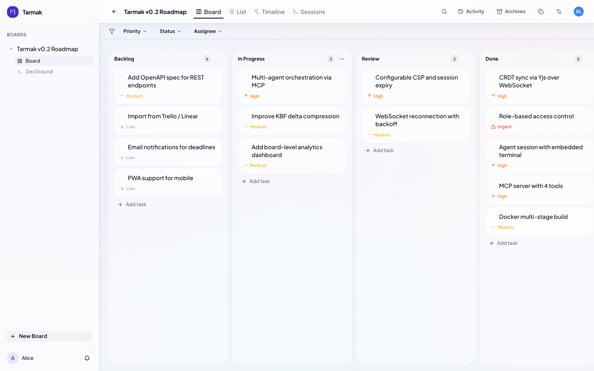

# Tarmak

The developer's kanban board — built for humans and AI agents.

[](https://github.com/tienedev/tarmak/actions/workflows/backend.yml)
[](https://github.com/tienedev/tarmak/actions/workflows/frontend.yml)
[](LICENSE)
[](https://ghcr.io/tienedev/tarmak)

<p align="center">
  
</p>

AI-assisted development is powerful but locked behind the terminal. Tarmak gives the whole team — PMs, designers, developers — a kanban interface to pilot AI agents like Claude Code. Click "Run" on a task, watch the agent work in a live terminal, get production-quality code.

## Features

### For everyone

- **Agent sessions** — click "Run" on any task, Claude Code executes in an embedded terminal
- **Multiple views** — drag-and-drop kanban, sortable list, Gantt-style timeline, sessions
- **Real-time collaboration** — CRDT sync (Yjs) with live presence
- **Multi-user** — role-based access (Owner, Member, Viewer), board sharing via invite links
- **Rich editing** — Tiptap-based markdown editor
- **Custom fields**, labels, subtasks, comments, attachments, notifications
- **i18n** — English and French

### For AI agents

- **MCP server** — stdio and SSE transports, 4 tools (query, mutate, sync, ask)
- **KBF** (Kanban Bit Format) — compact token-efficient format for AI communication
- **Atomic task claiming** — advisory locks prevent race conditions between agents
- **Skills plugin** — Claude Code integration with brainstorming, planning, TDD, debugging, code review workflows
- **Natural language queries** — "what's overdue?", "unassigned tasks", board stats

### For ops

- **TypeScript monorepo** — Turborepo, Hono, tRPC, Drizzle
- **SQLite** — zero external dependencies, file-based persistence
- **Docker** — multi-stage build, published to ghcr.io/tienedev/tarmak
- **Self-hosted** — your data stays on your infrastructure
- **CLI** — `tarmak init`/`uninit` for repo setup, backup/restore, export/import, user management

## Quick Start

### Docker

```bash
docker run -d --name tarmak \
  -p 4000:4000 \
  -v tarmak-data:/data \
  ghcr.io/tienedev/tarmak:latest
```

Or with docker compose:

```bash
docker compose up -d
```

Open [http://localhost:4000](http://localhost:4000), create an account, and you're in.

### From source

```bash
git clone https://github.com/tienedev/tarmak.git
cd tarmak
cp .env.example .env
make install  # install dependencies
make dev      # starts backend (4000) + agent (9876) + frontend (3000)
```

Open [http://localhost:3000](http://localhost:3000). Requires [Node.js](https://nodejs.org/) 22+ and [pnpm](https://pnpm.io/).

### Quick setup with CLI

```bash
cd /path/to/your-project
npx tarmak init
```

This configures `.mcp.json` and installs the Tarmak skills plugin. Use `--server <url>` for SSE mode or `--stdio` for standalone. To remove: `npx tarmak uninit`.

### MCP configuration

Or add manually to your Claude Code MCP config:

```json
{
  "mcpServers": {
    "tarmak": {
      "command": "tarmak",
      "args": ["mcp"]
    }
  }
}
```

| Tool | Purpose |
|------|---------|
| `board_query` | Read board state (KBF or JSON) |
| `board_mutate` | Create, update, move, delete entities |
| `board_sync` | Apply KBF deltas, return current state |
| `board_ask` | Natural language queries about the board |

## Architecture

```
packages/
  shared/      Types, Zod schemas, constants
  db/          Drizzle ORM + SQLite schema + repos
  kbf/         Kanban Bit Format codec
apps/
  api/         Hono + tRPC + Better Auth + MCP + WebSocket
  web/         React 19 + Vite + Tailwind + shadcn/ui
  agent/       Claude Agent SDK + Hono server
skills/        Claude Code plugin — skills, agents, hooks
```

| Layer | Stack |
|-------|-------|
| Backend | TypeScript, Hono, tRPC, Drizzle, SQLite |
| Frontend | React 19, TypeScript, Vite, Tailwind, shadcn/ui |
| Real-time | Yjs (CRDT) over WebSocket |
| AI | MCP, KBF, xterm.js |
| Agent | Claude Agent SDK, Hono |

## Contributing

See [CONTRIBUTING.md](CONTRIBUTING.md) for full details.

### Quick setup

```bash
cp .env.example .env
make install
make dev
```

### Commands

| Command | Description |
|---------|-------------|
| `make dev` | Start all dev servers |
| `make back` | Backend only |
| `make front` | Frontend with HMR |
| `make agent` | Agent server |
| `make build` | Production build |
| `make clean` | Clean all build artifacts |
| `make kill` | Kill running dev processes |
| `make test` | Run all tests |
| `make lint` | Lint all packages |

See [CLAUDE.md](CLAUDE.md) for detailed codebase patterns and conventions.

## License

[MIT](LICENSE)
