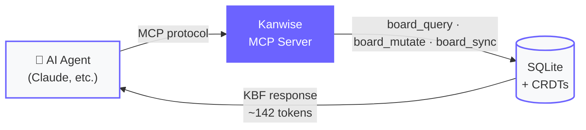
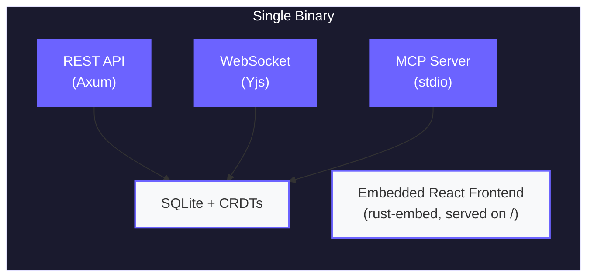

<div align="center">

# Kanwise

**The AI-native kanban board. Self-hosted. Single binary.**

[Why Kanwise](#why-kanwise) · [Quick Start](#quick-start) · [MCP Integration](#mcp-integration) · [Kanban Tracking Skill](#kanban-tracking-skill) · [Features](#features) · [Contributing](#contributing)

</div>

---

Kanwise is a self-hosted kanban board designed for AI-first workflows. It ships as a single binary — Rust backend, React frontend, and SQLite all embedded. No external dependencies.

What makes it different: a built-in **MCP server** and a custom **KBF protocol** that makes AI interactions with your boards **~95% more token-efficient** than raw JSON.

## Why Kanwise

### Built for AI agents

Kanwise speaks MCP natively. Claude, or any MCP-compatible agent, can query, create, move, and organize your tasks — directly from your IDE or chat.

Only 3 tools are exposed (`board_query`, `board_mutate`, `board_sync`), intentionally minimal to reduce token overhead and keep agent interactions fast and cheap.



### KBF: 95% fewer tokens

Traditional project management tools send entire JSON payloads to AI agents. Kanwise uses **KBF (Kanban Bit Format)**, a compact wire protocol that encodes board state with schema headers and positional delimiters.

```
# JSON: 2,847 tokens
{"boards":[{"id":"abc-123","name":"Sprint 24","columns":[{"id":"col-1","name":"Todo","position":0,"tasks":[{"id":"task-1","title":"Fix auth bug","priority":"high",...}]}]}]}

# KBF: 142 tokens (95% reduction)
B|abc-123|Sprint 24
C|col-1|Todo|0
T|task-1|Fix auth bug|high|0
```

This means your AI agents consume dramatically fewer tokens per interaction — saving cost and context window for what matters.

### Real-time collaboration

CRDT-based sync powered by Yjs. Multiple users edit simultaneously with automatic conflict resolution. Live presence shows who's viewing what — like Figma, but for your kanban board.

### One binary, zero ops

```bash
./kanwise  # that's it
```

No Postgres, no Redis, no Docker required. SQLite embedded. Frontend embedded. Serves everything on port 3001. Deploy anywhere that runs a binary.

## Quick Start

### Docker

```bash
docker run -d \
  -p 3001:3001 \
  -v kanwise-data:/data \
  ghcr.io/tienedev/kanwise:latest
```

### Docker Compose

```bash
docker compose up -d
```

### From source

```bash
git clone https://github.com/tienedev/kanwise.git
cd kanwise
make install  # install frontend dependencies
make dev      # start dev servers (backend + frontend)
```

### Production binary

```bash
make build
./target/release/kanwise
```

Open http://localhost:3001 and create your account.

### Configuration

| Variable | Default | Description |
|----------|---------|-------------|
| `DATABASE_PATH` | `kanwise.db` | Path to SQLite database |
| `KANBAN_ALLOWED_ORIGINS` | `http://localhost:3000,http://localhost:3001` | Comma-separated CORS origins |
| `KANBAN_ENV` | — | Set to `production` to enforce security |

## MCP Integration

Kanwise includes a built-in MCP server that lets Claude (or any MCP-compatible agent) manage your boards directly. The setup script handles everything — pick the mode that fits your setup:

### With Docker (recommended)

No Rust, no Node — just Docker.

```bash
./scripts/setup-claude.sh --docker
```

This pulls the Docker image, configures the MCP server in `~/.claude/.mcp.json`, and installs the kanban-tracking skill. That's it.

**Requires:** Docker installed and running.

### From source

If you have Rust and Node.js installed, or you're contributing to Kanwise:

```bash
./scripts/setup-claude.sh
```

This builds the binary, installs it to `~/.local/bin/`, configures MCP, and installs the skill.

**Requires:** Rust toolchain, Node.js.

### What the script does

Both modes configure the same two things:

| File | Purpose |
|------|---------|
| `~/.claude/.mcp.json` | Registers Kanwise as an MCP server for Claude Code |
| `~/.claude/skills/kanban-tracking/SKILL.md` | Installs the [kanban-tracking skill](#kanban-tracking-skill) |

Run `./scripts/setup-claude.sh --help` for all options.

### Manual setup

If you prefer to configure MCP yourself, add this to your Claude Desktop or Claude Code config:

<details>
<summary>Docker</summary>

```json
{
  "mcpServers": {
    "kanwise": {
      "command": "docker",
      "args": ["run", "-i", "--rm", "-v", "kanwise-data:/data",
               "ghcr.io/tienedev/kanwise:latest", "--mcp"]
    }
  }
}
```

</details>

<details>
<summary>Local binary</summary>

```json
{
  "mcpServers": {
    "kanwise": {
      "command": "kanwise",
      "args": ["--mcp"],
      "env": {
        "DATABASE_PATH": "~/.kanwise/kanwise.db"
      }
    }
  }
}
```

</details>

Then talk to your boards in natural language:

> "Create a board called Sprint 24 with columns Todo, In Progress, Review, Done"

> "Move all urgent tasks to the top of In Progress"

> "Show me a summary of what's blocked"

All responses use the KBF protocol — your agent gets full board context in a fraction of the tokens.

### MCP Tools

| Tool | Purpose |
|------|---------|
| `board_query` | Read board state (columns, tasks, fields). Returns KBF or JSON |
| `board_mutate` | Create, update, move, delete any entity |
| `board_sync` | Apply KBF deltas and return current state |

### Kanban Tracking Skill

Kanwise ships with a framework-agnostic AI skill (`skills/kanban-tracking/SKILL.md`) that turns your kanban board into a living project tracker during AI-assisted development. It works with any skill framework — [Superpowers](https://github.com/anthropics/claude-code), BMAD, custom workflows, or none at all.

Once installed (via `setup-claude.sh` or manually copied to `~/.claude/skills/kanban-tracking/`), the skill **automatically triggers** at generic workflow transitions:

- **A spec or design doc is produced** — proposes tasks from deliverables
- **An implementation plan is written** — maps plan steps to board tasks
- **A task or plan step is completed** — moves the matching task to Done
- **Work on a branch is wrapping up** — shows a board summary and flags in-progress tasks

You can also invoke it manually with `/kanban-sync` to view and manage your board from Claude Code.

By default, the skill never creates or moves tasks silently — it always proposes changes and waits for your approval. This behavior is configurable in `skills/kanban-tracking/SKILL.md` if you prefer fully autonomous tracking.

## Features

**Views** — Drag-and-drop kanban, sortable list, Gantt-style timeline

**Rich editing** — Tiptap editor for task descriptions with markdown support

**Custom fields** — Add text, number, URL, or date fields to any board

**Activity feed** — Track all changes with action and user filters

**Collaboration** — Real-time sync, live presence, comments, invite links

**Roles** — Owner, Member, Viewer with granular permissions

**Auth** — Password (Argon2), session tokens, API keys for integrations

**Security** — Rate limiting, CORS, security headers, input validation

## Architecture



| Layer | Technology |
|-------|-----------|
| Backend | Rust, Axum, SQLite (rusqlite) |
| Frontend | React 19, TypeScript, Tailwind CSS, shadcn/ui |
| Real-time | Yjs (CRDT), y-websocket |
| Auth | Argon2, session tokens, API keys |
| AI | MCP protocol, KBF encoding |

## Contributing

Contributions are welcome. Please open an issue first to discuss what you'd like to change.

```bash
git clone https://github.com/tienedev/kanwise.git
cd kanwise
make install
make dev
```

Backend runs on port 3001, frontend on port 3000 with hot reload.

## License

[MIT](LICENSE)
