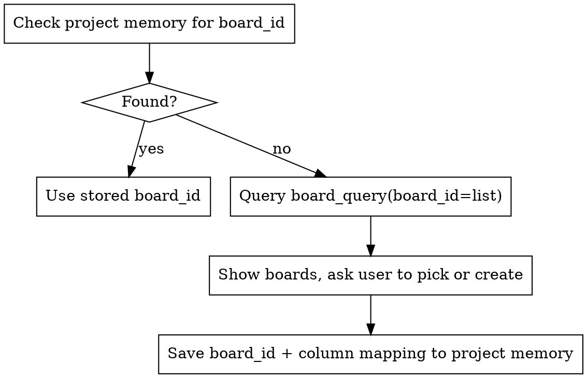

# Kanban Tracking

Project tracking via Kanwise MCP. Triggers automatically at workflow transitions, manually via `/kanban-sync`.

This skill is **framework-agnostic** — it reacts to workflow events (a spec was written, a plan was created, a step was completed), not to specific skill names. It works with any skill framework or no framework at all.

## Pre-requisites

Kanwise MCP server must be configured. If MCP tools `board_query`/`board_mutate` are not available, inform the user and skip gracefully.

## Board Resolution

Every operation starts by resolving the board for the current project:

For column name matching and memory format, consult `references/memory-schema.md`.

## Automatic Triggers

### When a design document or spec is produced

Any workflow that produces a design doc, spec, or requirements document (brainstorming, discovery, RFC, ADR, etc.):

1. Resolve board
2. Parse the document for key deliverables / components
3. **Propose** tasks to the user (list them, do NOT create silently)
4. On approval, `board_mutate` → `create_task` for each approved task into BACKLOG column
5. Summarize what was created

### When an implementation plan is written

Any workflow that produces a step-by-step implementation plan (written to a file, displayed in conversation, etc.):

1. Resolve board
2. Parse plan steps (numbered items from the plan)
3. **Propose** tasks mapped to plan steps
4. On approval, `board_mutate` → `create_task` for each into BACKLOG
5. Summarize what was created

### When a task or plan step is completed

When a unit of work is finished and verified (tests pass, implementation confirmed, etc.):

1. Resolve board
2. Query current tasks: `board_query(board_id, scope="tasks")`
3. Find the task matching the completed work (by title similarity)
4. `board_mutate` → `move_task` to DONE column
5. Brief confirmation (one line)

### When wrapping up a body of work

Before merging, creating a PR, or closing out a feature branch:

1. Resolve board
2. Query all tasks: `board_query(board_id, scope="all")`
3. Show summary: N tasks done, N still in progress, N in backlog
4. Flag any tasks still in progress — ask if they should be moved to Done or left

## Manual Trigger: /kanban-sync

When the user invokes `/kanban-sync`:

1. Resolve board
2. Query full state: `board_query(board_id, scope="all", format="kbf")`
3. Display the board state clearly (columns with tasks)
4. Ask: "What would you like to do?" — options:
   - Create tasks
   - Move tasks
   - Update a task
   - Just checking the board (no action)
5. Execute the requested mutations via `board_mutate`

## Examples

### Example 1: After brainstorming a new feature

User finishes a brainstorming session that produces a design spec with 4 components.

Actions:
1. Resolve board → found in project memory
2. Parse spec → extract: Auth module, API routes, DB schema, UI components
3. Propose: "I found 4 deliverables. Create these as backlog tasks?"
4. User approves → create 4 tasks in BACKLOG

Result: 4 tasks created, one-line confirmation.

### Example 2: Completing a plan step

User says: "Step 3 is done, tests pass."

Actions:
1. Resolve board
2. Query tasks → find task matching step 3 by title
3. Move task to DONE

Result: "Moved 'Implement API routes' to Done."

### Example 3: Manual sync

User invokes `/kanban-sync`.

Actions:
1. Display board: 2 in Backlog, 1 In Progress, 3 Done
2. User says "move 'DB schema' to done"
3. Execute move

Result: Board updated, new state shown.

## Error Handling

### MCP server not available
If `board_query` or `board_mutate` tools are not found, say: "Kanwise MCP is not connected. Skipping board tracking." Continue the conversation normally.

### Board not found
If the stored `board_id` returns an error, clear the project memory entry and re-run board resolution from scratch.

### Task not found for matching
If no task matches the completed work by title similarity, ask the user: "I couldn't find a matching task on the board. Which task should I update?" Show the current task list.

### Mutation fails
If `board_mutate` returns an error, report the error to the user and suggest retrying. Do not silently swallow errors.

## Key Rules

- **Never create tasks without user confirmation.** Always propose first, then execute.
- **Never move tasks to In Progress automatically.** Only move to Done on step completion.
- **Keep it quiet.** Confirmations should be one line. Don't dump the full board unless asked.
- **Graceful degradation.** If MCP is not available, say so once and continue without tracking.
- **Board per project.** Each working directory maps to one board via project memory.

## References

For MCP tool signatures and parameters, consult `references/mcp-tools.md`.
For memory schema and column mapping patterns, consult `references/memory-schema.md`.
