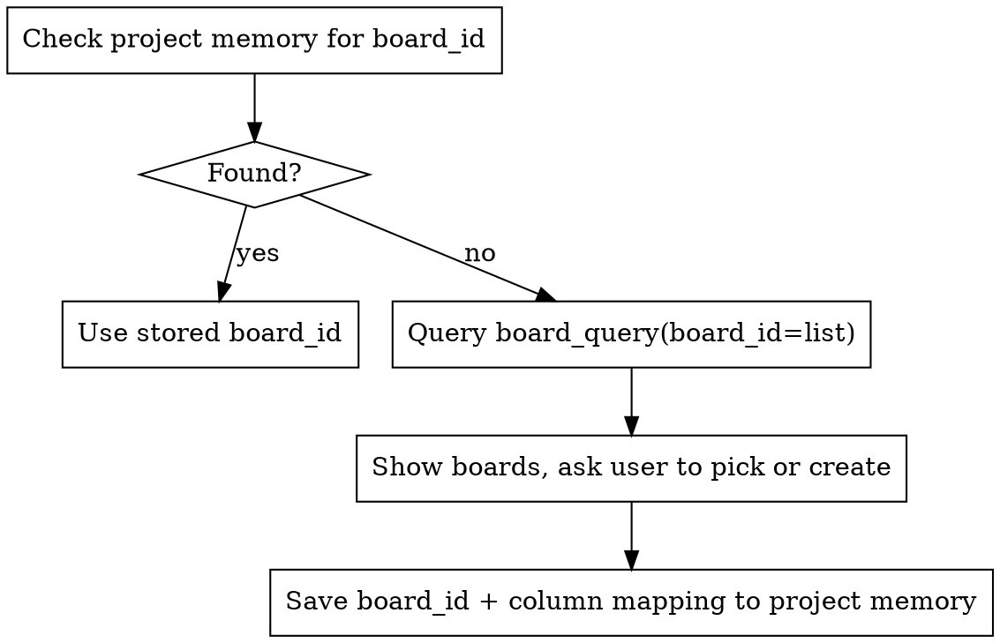

# Kanban Tracking

Project tracking via Kanwise MCP. Triggers automatically at generic workflow transitions, manually via `/kanban-sync`.

This skill is **framework-agnostic** — it reacts to workflow events (a spec was written, a plan was created, a step was completed), not to specific skill names. It works with any skill framework (Superpowers, BMAD, custom workflows, or no framework at all).

## Pre-requisites

Kanwise MCP server must be configured. If MCP tools `board_query`/`board_mutate` are not available, inform the user and skip gracefully.

## Board Resolution

Every operation starts by resolving the board for the current project:



**Column mapping** — infer from names:

| Pattern (case-insensitive) | Stage |
|---|---|
| `backlog`, `to do`, `todo`, `a faire` | BACKLOG |
| `in progress`, `doing`, `en cours` | IN_PROGRESS |
| `done`, `complete`, `termine`, `fait` | DONE |

If a column name doesn't match, ask once and save to project memory.

## Automatic Triggers

### When a design document or spec is produced

Any workflow that produces a design doc, spec, or requirements document (brainstorming, discovery, RFC, ADR, etc.):

1. Resolve board
2. Parse the document for key deliverables / components
3. **Propose** tasks to the user (list them, do NOT create silently)
4. On approval, `board_mutate` → `create_task` for each approved task into BACKLOG column
5. Summarize what was created

### When an implementation plan is written

Any workflow that produces a step-by-step implementation plan (written to a file, displayed in conversation, etc.):

1. Resolve board
2. Parse plan steps (numbered items from the plan)
3. **Propose** tasks mapped to plan steps
4. On approval, `board_mutate` → `create_task` for each into BACKLOG
5. Summarize what was created

### When a task or plan step is completed

When a unit of work is finished and verified (tests pass, implementation confirmed, etc.):

1. Resolve board
2. Query current tasks: `board_query(board_id, scope="tasks")`
3. Find the task matching the completed work (by title similarity)
4. `board_mutate` → `move_task` to DONE column
5. Brief confirmation (one line)

### When wrapping up a body of work

Before merging, creating a PR, or closing out a feature branch:

1. Resolve board
2. Query all tasks: `board_query(board_id, scope="all")`
3. Show summary: N tasks done, N still in progress, N in backlog
4. Flag any tasks still in progress — ask if they should be moved to Done or left

## Manual Trigger: /kanban-sync

When the user invokes `/kanban-sync`:

1. Resolve board
2. Query full state: `board_query(board_id, scope="all", format="kbf")`
3. Display the board state clearly (columns with tasks)
4. Ask: "What would you like to do?" — options:
   - Create tasks
   - Move tasks
   - Update a task
   - Just checking the board (no action)
5. Execute the requested mutations via `board_mutate`

## Key Rules

- **Never create tasks without user confirmation.** Always propose first, then execute.
- **Never move tasks to In Progress automatically.** Only move to Done on step completion.
- **Keep it quiet.** Confirmations should be one line. Don't dump the full board unless asked.
- **Graceful degradation.** If MCP is not available, say so once and continue without tracking.
- **Board per project.** Each working directory maps to one board via project memory.

## MCP Tool Reference

```
board_query:   { board_id, scope?: "info"|"tasks"|"columns"|"all", format?: "kbf"|"json" }
board_mutate:  { board_id, action, data }
  actions:     create_task, update_task, move_task, delete_task,
               create_column, create_board
board_sync:    { board_id, delta?, format? }
```

## Memory Schema

Save to project memory as `kanban_board.md`:

```markdown
---
name: kanban-board-mapping
description: Kanwise board mapping for this project
type: project
---

Board ID: <uuid>
Board name: <name>
Column mapping:
  BACKLOG: <column_id>
  IN_PROGRESS: <column_id>
  DONE: <column_id>
```
